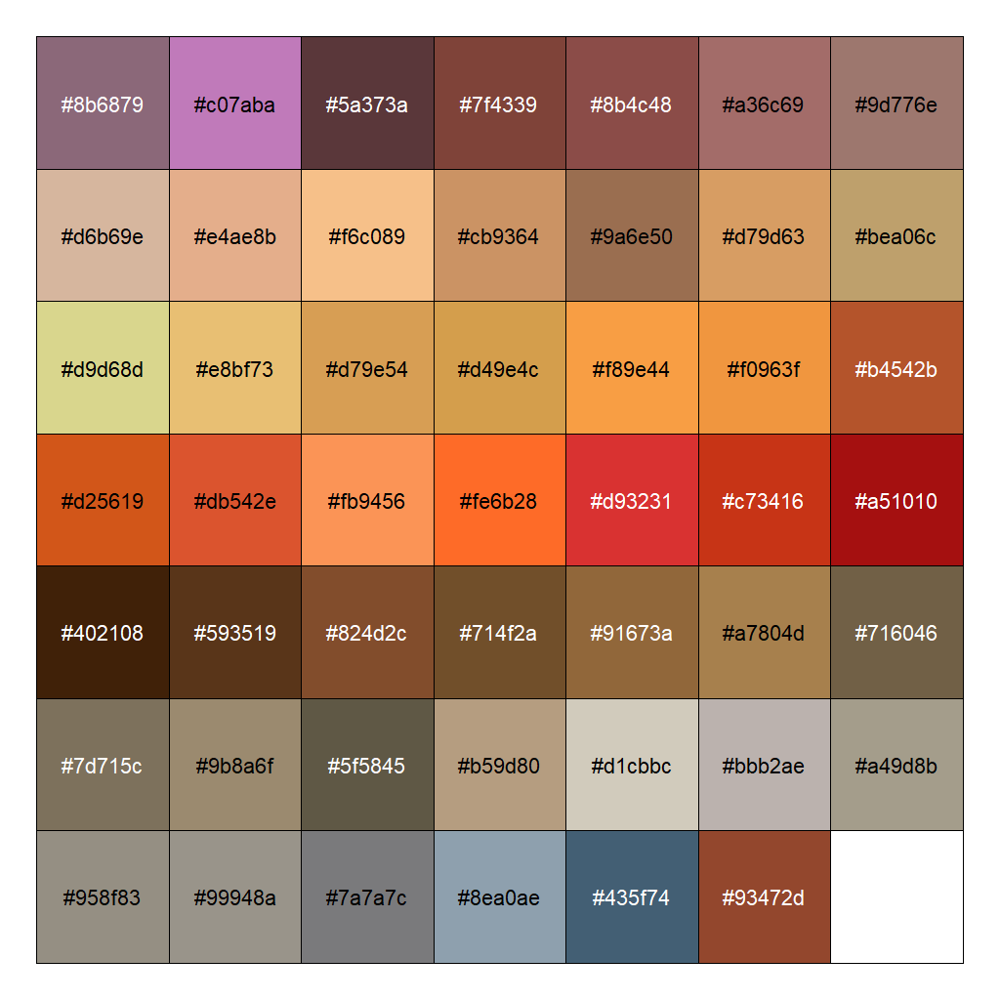

# mooncolors

<!-- badges: start -->
<!-- badges: end -->

This R package provides a dataset of colors corresponding to 48 different colors of the Moon.



## Installation

You can install mooncolors from GitHub using the devtools package:

``` r
devtools::install_github("amelialouise/mooncolors")
```

